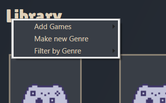

[Description]  
  
Crappy Launcher is a simple game Launcher with the ability to pick a random game. 
CL brings all your games in one place, so you don't have to-  
open a different launcher for every game. 
*Games will still launch through their required launcher. 
  

  
[Notes]  
  
Launcher installs in C:/Users/User/AppData/Local/CrappyLauncher due to Velopack limitations. (Safe to move) 
Config files live in C:/Users/User/AppData/Roaming/Crappy Launcher. (DO NOT MOVE) 
  
For Alpha versions, if updating the app causes it to no-  
longer launch, Consider Deleting the config files and retrying. 
  
Highlights (Release 1.0.5):
  
Additions:  
	Added a way to search banners online (SteamGridDB). 
	Added a way to create genre. 
	Added a way to add genre to games.  
	Added a way to Filter through genre. 
	Changed Context menu style. 

  

  
	
Dependencies:  
	Velopack 
	ValveKeyValue 