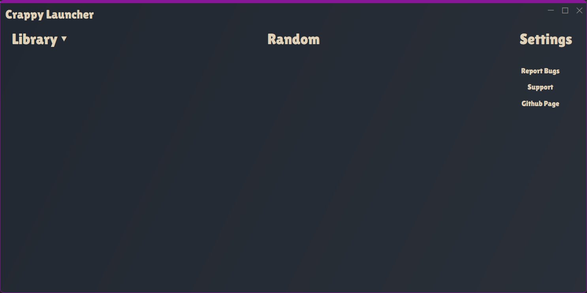
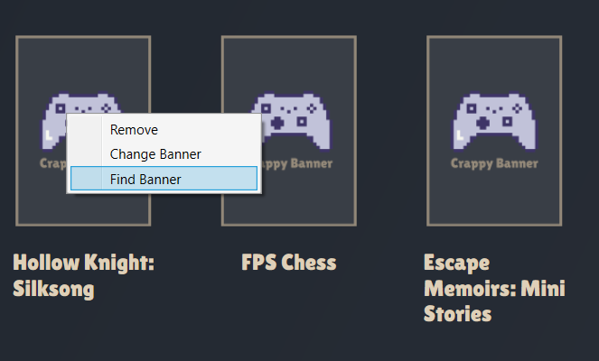

Crappy Launcher is a simple game Launcher, It's main feature being the ability to launch a random game.

Crappy launcher is made to bring all your games into one place, 
seeing how some games require their own seperate launcher.

NOTE: Currently the Setup.exe installs the Launcher in C:/Users/User/AppData/Local/CrappyLauncher

Highlights (Release 1.0.5):

Additions:
	Added a way to search banners online.

	

Dependencies:
	Velopack
	ValveKeyValue