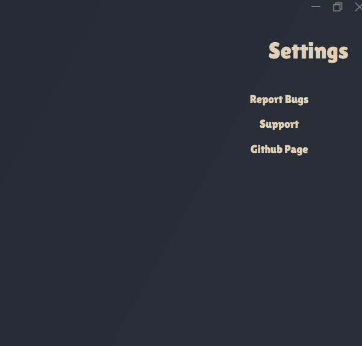

Crappy Launcher is a simple game Launcher, It's main feature being the ability to launch a random game.

Crappy launcher is made to bring all your games into one place, 
seeing how some games require their own seperate launcher.

NOTE: Currently the Setup.exe installs the Launcher in C:/Users/User/AppData/Local/CrappyLauncher

Highlights (Alpha 1.0.2):

Additions:
	Added Settings Window.
	Added a way to import local steam library.

	
Removals:
	Removed the option to select a directory to Add games.
		Reason: If a folder had multiple .exe files they all got added.
				Until a solution is found, this feature will sit it out.
	Removed Patch Notes button.
		Reason: Felt unnecessary, Might be added back in the future.

Dependencies:
	Velopack
	ValveKeyValue